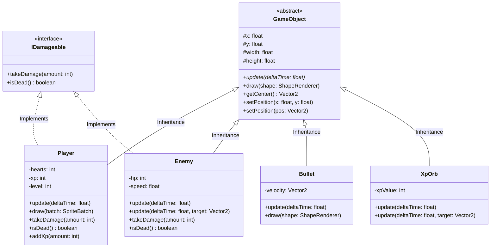

# Laporan Tugas Akhir PBO: "He Is Not Human Bro"

Laporan ini disusun secara komprehensif untuk memenuhi seluruh rubrik dan ketentuan wajib Tugas Akhir Praktikum Pemrograman Berbasis Objek (PBO) Program Game Berbasis Java OOP.

---

## BAGIAN A – PERANCANGAN SISTEM (DESAIN)

### 1. Desain Class
Game ini dirancang menggunakan 6 class utama untuk memastikan modularitas:

1. **`GameObject` (Abstract Class)**
   *   **Peran:** Sebagai blueprint (cetak biru) dasar untuk semua objek fisik dalam game.
   *   **Atribut Utama:** `float x, y` (posisi), `float width, height` (ukuran).
   *   **Method Utama:** `abstract void update(float deltaTime)`, `void draw(ShapeRenderer)`, `Vector2 getCenter()`.
2. **`Player` (Subclass)**
   *   **Peran:** Karakter utama yang dikendalikan oleh pemain.
   *   **Atribut Utama:** `int hearts, xp, level`, `float speed`, animasi/spritesheet.
   *   **Method Utama:** `void update()`, `void draw(SpriteBatch)`, `void takeDamage()`, `void addXp()`.
3. **`Enemy` (Subclass)**
   *   **Peran:** Karakter musuh yang mengejar pemain.
   *   **Atribut Utama:** `int hp`, `float speed`.
   *   **Method Utama:** `void update(float deltaTime, Vector2 target)`, `void takeDamage()`.
4. **`Bullet` (Subclass)**
   *   **Peran:** Proyektil serangan dari pemain.
   *   **Atribut Utama:** `Vector2 velocity`.
   *   **Method Utama:** `void update(float deltaTime)`.
5. **`XpOrb` (Subclass)**
   *   **Peran:** Item drop (poin/XP) dari musuh yang mati.
   *   **Atribut Utama:** `int xpValue`.
   *   **Method Utama:** `void update(float deltaTime, Vector2 target)` (untuk efek disedot/vakum).
6. **`GameManager` (Main Engine / ApplicationAdapter)**
   *   **Peran:** Mengatur *game loop*, *state* (Menu, Playing, Game Over), *spawn* musuh, dan deteksi tabrakan (collision).

### 2. Desain OOP (Penerapan 7 Prinsip Wajib)
*   **Encapsulation:** Diterapkan di hampir semua class (seperti `Player`, `Enemy`). Atribut dibuat `private` (contoh: `private int hp;`) atau `protected` (contoh: `protected float x, y;` di `GameObject`), dan diakses melalui getter/setter (contoh: `public int getHp()`, `public Vector2 getCenter()`).
*   **Inheritance:** Terdapat struktur hierarki yang jelas. `GameObject` adalah *parent class*. Class `Player`, `Enemy`, `Bullet`, dan `XpOrb` melakukan `extends GameObject` agar menuruni atribut posisi dan ukuran.
*   **Polymorphism:** Terlihat pada penggunaan method `draw(ShapeRenderer)` dan `update()`. Setiap turunan `GameObject` memiliki implementasi pergerakan dan cara menggambar wujudnya sendiri yang berbeda-beda, namun bisa dipanggil dengan cara yang seragam secara polimorfis di dalam array di `GameManager`.
*   **Method Overloading:** Diterapkan di class `Enemy` dan `XpOrb`. 
    *   `update(float deltaTime)` -> Objek diam.
    *   `update(float deltaTime, Vector2 target)` -> Objek bergerak mengejar/mendekati target.
    *   Serta di `GameObject`: `setPosition(float x, float y)` vs `setPosition(Vector2 pos)`.
*   **Method Overriding:** Class turunan wajib melakukan override (dilambangkan dengan `@Override`) terhadap method `update(float deltaTime)` dan `draw()` dari induk `GameObject` untuk mendefinisikan logika mereka secara spesifik.
*   **Abstract Class:** `GameObject` dideklarasikan sebagai `public abstract class GameObject`. Tidak bisa di-instansiasi langsung (`new GameObject()`), hanya bisa diturunkan. Class ini memiliki `abstract void update()`.
*   **Interface:** Dibuat interface `public interface IDamageable`. Interface ini mewajibkan class yang mengimplementasikannya memiliki method `takeDamage(int amount)` dan `boolean isDead()`. Diimplementasikan oleh `Player` dan `Enemy`.

### 3. Diagram UML & Relasi

---

## BAGIAN B – IMPLEMENTASI PROGRAM

### 1. Fitur Minimal Game
*   **Player dapat menyerang enemy:** Pemain menembak secara otomatis ke arah posisi *cursor mouse*. Peluru (`Bullet`) memiliki deteksi tabrakan dengan musuh.
*   **Enemy memiliki perilaku berbeda:** Musuh mengejar pemain menggunakan kalkulasi vektor dinamis (Method `update(deltaTime, target)`). Musuh bertambah cepat dan tangguh seiring berjalannya waktu.
*   **Sistem HP dan Damage:** Player menggunakan sistem Nyawa (Hearts) dan kebal (i-frames) sementara setelah diserang. Enemy menggunakan sistem integer HP (berkurang berdasarkan damage peluru).
*   **Sistem Leveling:** Jika musuh mati, mereka menjatuhkan `XpOrb`. Player mengumpulkan XP. Jika XP penuh, level naik, dan kemampuan pemain meningkat *(Fire Rate tembakan menjadi lebih cepat)*.
*   **Sistem Scoring:** Digantikan/diwujudkan dalam bentuk **Survival Time** (Waktu Bertahan Hidup yang tampil di HUD) dan **Level** pemain. Semakin lama bertahan, semakin tinggi skor/prestasi pemain.

### 2. Implementasi OOP di Kode (Bukti)
*   **Encapsulation:** `Player.java` baris 33: `private int hearts;` diakses melalui `public int getHearts()`.
*   **Inheritance:** `Bullet.java` baris 10: `public class Bullet extends GameObject`.
*   **Polymorphism:** `GameManager.java` baris 465-467: memanggil method `draw()` pada list objek yang berbeda (`enemies`, `bullets`, `xpOrbs`) meski implementasi menggambarnya berbeda (kotak vs lingkaran).
*   **Overloading:** `Enemy.java` baris 27 dan 32: `update(float deltaTime)` dan `update(float deltaTime, Vector2 target)`.
*   **Overriding:** `Player.java` baris 93: `@Override public void update(float deltaTime)` menggantikan versi kosong milik GameObject.
*   **Abstract:** `GameObject.java` baris 11: `public abstract class GameObject`.
*   **Interface:** `IDamageable.java` baris 7, dipakai di `Player.java` baris 17: `public class Player extends GameObject implements IDamageable`.

---

## BAGIAN C – ANALISIS (JAWABAN TEORI)

1.  **Mengapa OOP cocok digunakan untuk game ini?**
    Game ini memiliki banyak entitas fisik yang memiliki kesamaan dasar (memiliki koordinat, ukuran, perlu di-update dan di-render di layar) namun memiliki perilaku spesifik (peluru meluncur lurus, musuh mengejar). OOP memungkinkan kita mengelompokkan logika-logika ini dalam *class-class* terpisah, membuat kode lebih bersih, tidak menumpuk di satu tempat, dan sangat mudah untuk dimodifikasi atau ditambah entitas baru.
2.  **Apa keuntungan inheritance dalam desain game Anda?**
    Sangat mengurangi duplikasi kode. Atribut *boilerplate* seperti `x`, `y`, `width`, `height`, serta method utilitas seperti `getCenter()` hanya ditulis satu kali di induk (`GameObject`). Seluruh class spesifik (`Enemy`, `Player`, dll.) cukup berfokus pada logika spesifik mereka sendiri (pergerakan/animasi khusus).
3.  **Bagaimana polymorphism mempermudah pengembangan fitur?**
    Di dalam `GameManager`, saya cukup membuat *looping* sederhana memanggil `.draw()` untuk list musuh dan peluru, tanpa perlu menggunakan `if-else` mengecek tipe objeknya. Sistem Java secara dinamis (Dynamic Method Dispatch) akan tahu cara menggambar masing-masing objek. Jika saya ingin menambah "Musuh Tipe Baru" atau "Peluru Laser", *game engine* utama hampir tidak perlu dirombak.
4.  **Apa risiko jika tidak menggunakan encapsulation?**
    Jika variabel seperti `hp` atau `hearts` bersifat `public`, bagian kode lain (misal menu UI atau bug sistem kalkulasi kordinat) bisa tidak sengaja mengubah nilainya menjadi minus atau tidak valid. Dengan encapsulation, modifikasi nyawa harus melewati gerbang setter `takeDamage()` yang memastikan bahwa nyawa berkurang sesuai aturan (misal, mengecek apakah player sedang ada di masa *invincibility frames*).
5.  **Bagaimana program Anda dapat dikembangkan lebih lanjut?**
    *   **Polymorphism Tambahan:** Membuat *class* musuh turunan baru (`BossEnemy`, `RangedEnemy`) yang `extends Enemy`.
    *   **Desain Pola (Pattern):** Menggunakan *Object Pooling* untuk `Bullet` dan `XpOrb` untuk menghemat memori *Garbage Collector* dan meningkatkan FPS.
    *   **Ekspansi Kemampuan:** Mengimplementasikan "Interface" tambahan seperti `ICollidable` yang mendukung perhitungan *hitbox* lebih presisi (poligon, bukan sekadar persegi/lingkaran).

---

## BAGIAN D – PANDUAN PRESENTASI (DRAFT 10-15 MENIT)

Gunakan struktur presentasi berikut untuk demonstrasi di kelas:

**1. Pendahuluan (2 Menit)**
*   *Salam & Perkenalan.*
*   "Hari ini saya akan mendemonstrasikan game berjudul 'He Is Not Human Bro', sebuah *survival-shooter* ringan menggunakan Java dan *framework* LibGDX."
*   "Tujuannya adalah bertahan selama mungkin dari kejaran musuh yang jumlahnya semakin banyak. Kita harus mencari XP untuk menaikkan level agar tembakan kita semakin cepat."

**2. Desain Sistem & Arsitektur (3 Menit)**
*   Tampilkan *Mermaid UML Class Diagram* di slide Anda.
*   "Arsitektur saya bertumpu pada pondasi abstract class bernama `GameObject`. Ini yang menyatukan semua benda fisik di layar."
*   "Lalu saya memiliki `Player` yang mengontrol jalannya game, dan sekumpulan entitas lain seperti `Enemy`, `Bullet`, dan `XpOrb`."

**3. Implementasi 7 Pilar OOP (4 Menit)**
*(Tunjukkan kode di layar saat menjelaskan!)*
*   **Encapsulation:** "Lihat di class `Player`, nyawa pemain tidak bisa diubah sembarangan, harus lewat method `takeDamage` agar sistem bisa menahan damage jika sedang kebal."
*   **Inheritance:** "Class `Bullet` mewarisi `GameObject`. Saya tak perlu menulis ulang kordinat x dan y."
*   **Polymorphism:** "Di `GameManager`, fungsi `render()` memanggil `.draw()` pada setiap peluru dan musuh tanpa peduli tipe spesifik mereka."
*   **Overloading:** "Musuh bisa diam dengan `update(deltaTime)`, tapi bisa mengejar jika dipanggil dengan parameter target `update(deltaTime, Vector2 target)`."
*   **Overriding:** "Setiap subclass wajib membajak (`@Override`) metode `update` milik parent untuk menyetel gerakannya."
*   **Abstract & Interface:** " `GameObject` itu blueprint mentah, tak bisa diwujudkan (*abstract*). Dan `IDamageable` adalah kontrak wajib untuk entitas hidup."

**4. Demo Program (4 Menit)**
*   Jalankan game (via perintah `gradlew lwjgl3:run` atau jalankan via IDE).
*   Tunjukkan UI Main Menu yang halus.
*   Praktekkan pergerakan pemain, menembak, memungut XP, dan level up (tunjukkan Fire Rate yang bertambah cepat).
*   Biarkan pemain mati untuk menunjukkan layar Game Over.

**5. Analisis & Kesimpulan (2 Menit)**
*   "Kelebihan utama game ini adalah strukturnya yang sangat modular. Menambah boss baru sangat gampang, cukup buat turunan `Enemy`."
*   "Kekurangan saat ini: performa bisa menurun (lag) jika musuh/peluru mencapai angka ribuan karena saya belum menggunakan *Object Pool*."
*   "Terima kasih. Ada pertanyaan?"
